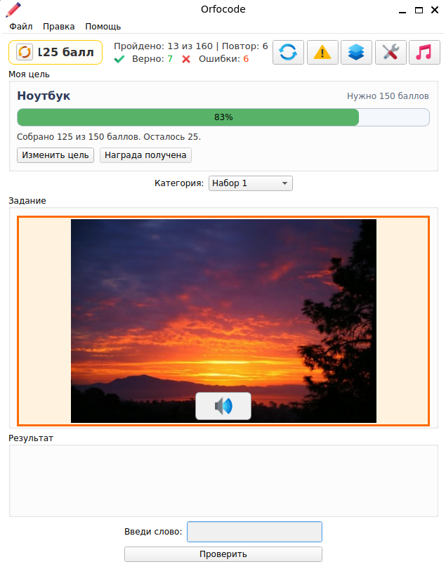
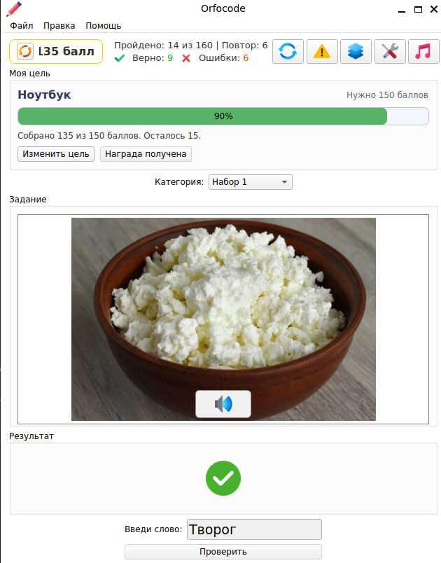
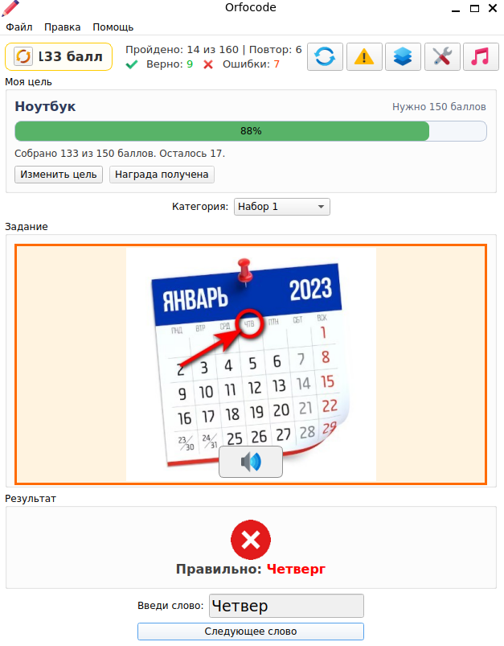
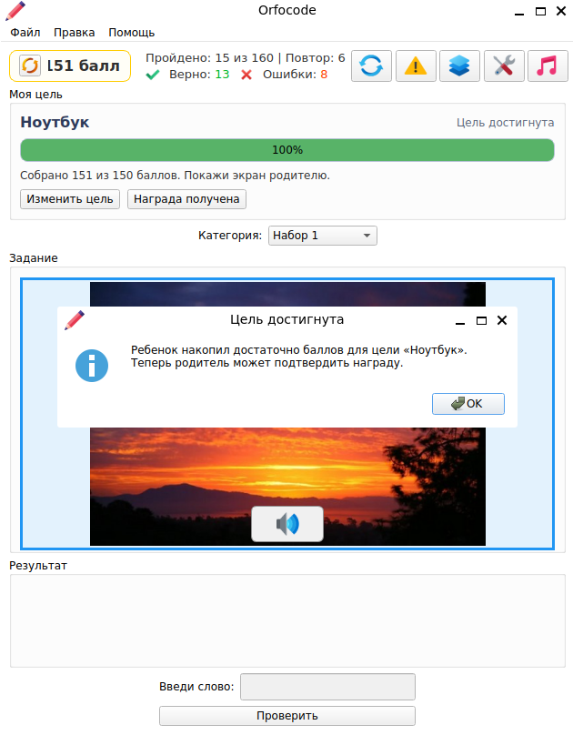
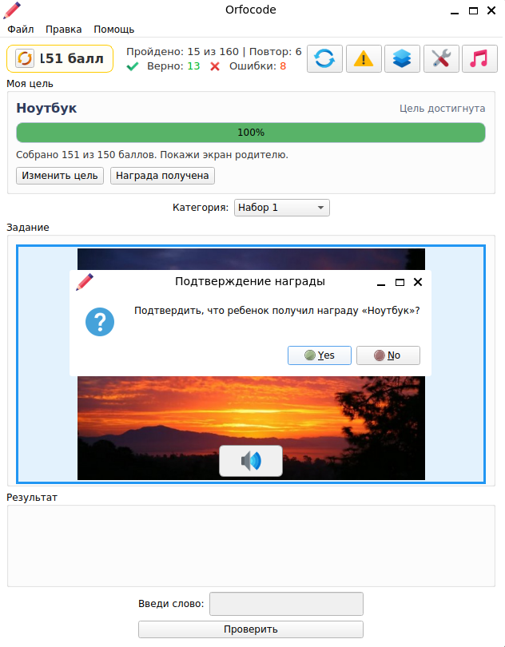
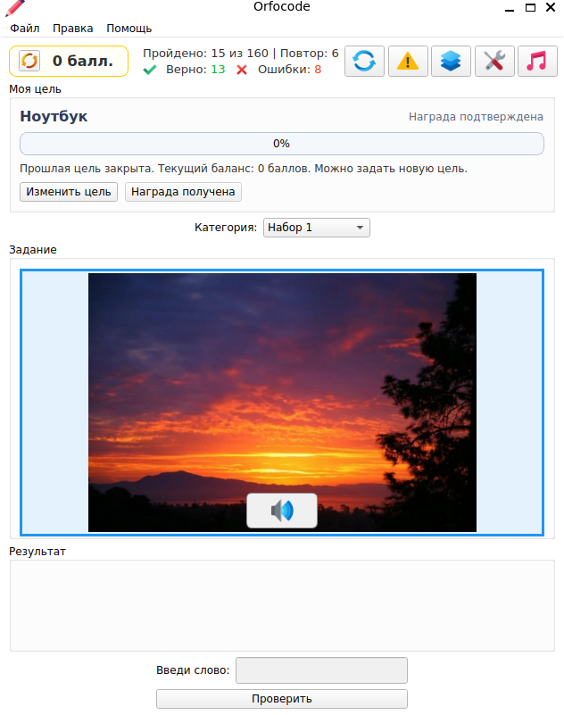

# Отчет по роли разработчика

## 1. Роль в проекте

Моя роль в проекте: `разработчик`.

В рамках этапа 2 моей задачей было подобрать техническое решение для реализации выбранной гипотезы, оценить возможность технической реализации идеи, разработать прототип с нуля и подготовить материалы для презентации.

## 2. Исходные данные проекта

Финальная проблема проекта сформулирована следующим образом: дети младшего и среднего школьного возраста быстро теряют мотивацию к выполнению орфографических упражнений, потому что сам процесс обучения кажется им скучным и не дает понятного вознаграждения. В результате родителям приходится постоянно уговаривать ребенка заниматься, что снижает эффективность обучения и создает напряжение.

Финальная гипотеза проекта: если внедрить в приложение систему реальных наград, в которой ребенок сможет выбрать желаемую цель и копить баллы за правильно написанные слова, то частота и регулярность занятий возрастут, а значит улучшатся и орфографические навыки.

Основные функции, которые должны быть в прототипе:

- тренажер орфографии с написанием слова под диктовку;
- поле ввода ответа и проверка правильности;
- начисление баллов за правильные ответы;
- отображение прогресса к выбранной награде;
- базовая статистика;
- настройки приложения.

Источники входных данных для разработки:

- системный анализ и финальные требования от аналитика команды;
- контент и изображения от исследователя команды.

## 3. Выбранное техническое решение

Для прототипа было выбрано следующее решение:

- язык: `Python`;
- фреймворк: `PySide6`;
- формат прототипа: `desktop-приложение`.

Почему был выбран именно этот вариант:

- Python — простой и понятный язык, позволяющий быстро написать прототип;
- PySide6 предоставляет готовые компоненты для построения интерфейса (кнопки, поля ввода, прогресс-бар);
- в отличие от статичного макета можно показать реальную логику проверки слов, начисления баллов и достижения цели;
- такой формат удобен для демонстрации на защите.

## 4. Сравнение с альтернативами

### Вариант 1. Figma

Плюсы:

- позволяет быстро сделать визуальные экраны;
- подходит для демонстрации интерфейсной структуры.

Минусы:

- не показывает реальную логику работы приложения;
- нельзя полноценно продемонстрировать начисление баллов, проверку слов и достижение награды;
- прототип остается в основном кликабельным, но не функциональным.

Вывод:

`Figma` подходит для макета интерфейса, но хуже подходит для демонстрации учебной и игровой механики продукта.

### Вариант 2. Web-прототип

Плюсы:

- удобно запускать в браузере;
- в будущем такой вариант проще масштабировать.

Минусы:

- потребовалась бы отдельная разработка интерфейса и логики;
- увеличилось бы время реализации;
- для текущего проекта нет готовой web-основы.

Вывод:

Web-прототип является перспективным вариантом для дальнейшего развития, но не оптимален для быстрого MVP на этапе 2.

### Вариант 3. Flutter

Плюсы:

- кроссплатформенность;
- возможность развивать проект как мобильное приложение.

Минусы:

- требует изучения нового фреймворка (Dart + Flutter);
- срок реализации был бы значительно выше;
- для учебного этапа это избыточное решение.

Вывод:

`Flutter` подходит скорее для следующего этапа развития продукта, чем для быстрой сборки учебного прототипа.

## 5. Итоговый выбор

В итоге для реализации прототипа было выбрано решение `Python + PySide6`.

Это решение оказалось наиболее подходящим, потому что позволило быстро разработать функциональный прототип и получить не просто набор экранов, а интерактивное приложение с реальной логикой пользовательского сценария.

## 6. Заключение о технической реализуемости

Идея проекта технически реализуема.

На уровне MVP возможно реализовать:

- тренировку написания слов под диктовку;
- начисление баллов за правильные ответы;
- выбор и отображение цели;
- прогресс к награде;
- базовую статистику;
- подтверждение награды родителем.

На следующих этапах можно расширить решение:

- семейным аккаунтом для нескольких детей;
- каталогом реальных наград;
- историей целей;
- расширенной аналитикой использования;
- облачным хранением данных.

## 7. Что было сделано в прототипе

В рамках моей работы были выполнены следующие действия:

- с нуля разработан орфографический тренажёр с проверкой написания слов под диктовку;
- реализована система начисления баллов за правильные ответы;
- создан интерфейсный блок `Моя цель` с выбором награды и установкой стоимости в баллах;
- реализован прогресс-бар достижения цели;
- добавлена возможность изменить цель;
- добавлена возможность подтвердить получение награды родителем;
- реализована базовая статистика тренировок и настройки приложения.

Таким образом, прототип был полностью разработан с нуля под финальную концепцию продукта.

## 8. Логика работы прототипа

Пользовательский сценарий прототипа:

1. Родитель или ребенок открывает приложение.
2. В блоке `Моя цель` задается желаемая награда и необходимое количество баллов.
3. Ребенок запускает тренировку и прослушивает слово.
4. Ребенок вводит слово в поле ответа.
5. За правильный ответ начисляются баллы.
6. Прогресс к выбранной цели обновляется на экране.
7. После достижения цели родитель может подтвердить получение награды.

## 9. Скриншоты и визуализация

Прототип реализован в формате одного основного экрана, который показывает разные состояния интерфейса в зависимости от действий пользователя. Для демонстрации логики продукта в отчет и презентацию нужно вставить следующие изображения:

1. 

   Подпись: Базовый интерфейс приложения. На экране отображаются текущий баланс баллов, статистика тренировки, блок `Моя цель`, прогресс к награде, категория слов, область задания и поле для ввода ответа.

2. 

   Подпись: Пример успешной попытки. Пользователь правильно вводит слово, получает положительный результат, а количество баллов и прогресс к цели увеличиваются.

3. 

   Подпись: Пример неудачной попытки. Приложение показывает ошибку и правильный ответ, что позволяет использовать прототип не только как игровой, но и как обучающий инструмент.

4. 

   Подпись: Уведомление о достижении цели. После накопления нужного количества баллов система сообщает, что цель достигнута, и предлагает показать экран родителю.

5. 

   Подпись: Подтверждение получения награды родителем. Родитель подтверждает, что ребенок действительно получил обещанное вознаграждение.

6. 

   Подпись: Сброшенный прогресс после подтверждения награды. Баллы обнуляются, предыдущая цель считается закрытой, и пользователь может задать новую цель.

## 10. Что добавить в презентацию

На слайды по роли разработчика нужно вынести:

- выбранное техническое решение: `Python + PySide6`;
- сравнение с альтернативами `Figma`, `Web`, `Flutter`;
- вывод о технической реализуемости гипотезы;
- краткое описание того, что реализовано в MVP;
- скриншоты интерфейса прототипа в разных состояниях: базовый экран, успешная попытка, неудачная попытка, достижение цели, подтверждение награды, сброс прогресса.

## 11. Краткий текст для выступления

На этапе 2 по роли разработчика я занимался подбором технического решения и разработкой прототипа с нуля. Для реализации был выбран стек `Python + PySide6`, потому что он позволяет быстро создать функциональное desktop-приложение с интерактивным интерфейсом. В прототипе был реализован основной пользовательский сценарий: ребенок проходит тренировку, получает баллы, видит прогресс к цели и после достижения цели родитель подтверждает награду. Это позволяет сделать вывод, что идея проекта технически реализуема и может быть развита в полноценный продукт.

## 12. Что осталось сделать вручную

- запустить приложение и проверить итоговый пользовательский сценарий;
- сделать скриншоты приложения;
- вставить скриншоты в отчет и презентацию;
- использовать финальные материалы при защите проекта.
