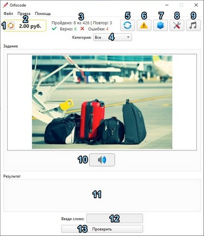
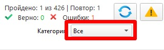
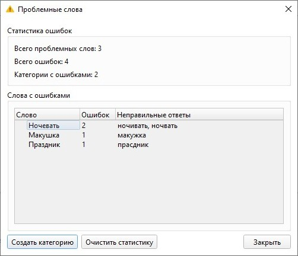
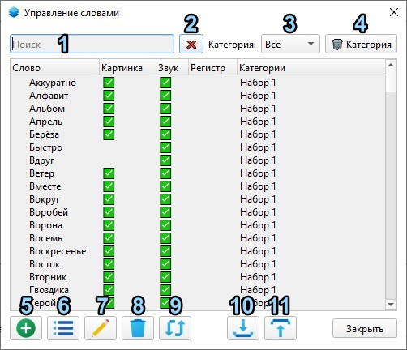
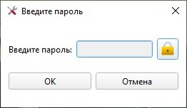
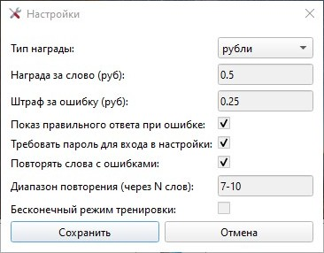

Тренажёр орфографии ORFOCODE

## Главное окно программы

1. Обнулить счёт.
2. Счёт (рубли, баллы. Меняется в настройках).
3. Счётчик пройденных слов и верных/неверных ответов.
4. Выбор словаря либо все сразу.
5. Сбросить прогресс (счётчик).
6. Статистика ошибок.
7. Словарь (все слова).
8. Настройки.
9. Выключить/включить музыку. (пока тестовая).
10. Прослушать слово.
11. Результат проверки.
12. Поле для ввода слова.
13. Кнопка "Проверить".

## Как пользоваться:
1. Прослушать слово (Это основа программы. Произносится как обычно при разговоре)
2. Напечатать слово без ошибок
3. Нажать **Enter** или **"Проверить"**.
4. Стать молодцом.

## Как пользоваться. Поподробнее.
Выбрать словарь. Пока это называет "Категория".
 

 
Есть два словаря. Просто поделил слова на две части, без какого-либо принципа.
Либо выбрать **"Все"**, тогда тренировка будет вообще по всем словам. Всего есть 426 слов.
Некоторые слова есть без картинки, будет показана заглушка.

При первом запуске программы звук не проигрывается, нужно нажать кнопку "Прослушать". Далее звук будет проигрываться сам при каждом последующем слове.
Переключение на следующее слово происходит автоматически если дан правильный ответ. Если ответ неправильный, то будет показан верный ответ.

---

## Статистика ошибок

В этом окне хранятся все сделанные ошибки.
Кнопкой **"Создать категорию"** можно создать словарь только из этих слов с ошибками и пройтись только по ним. Этот словарь можно будет удалить.
Кнопкой **"Очистить статистику"** можно всё в этом окне удалить.

## Словарь

В этом окне можно посмотреть все слова. Их можно редактировать, удалять, добавлять.

1. Поиск
2. Очистить поиск
3. Фильтр слов по категории
4. Удалить выбранную категорию
5. Добавить новое слово
6. Добавить сразу много слов
7. Редактировать слово
9. Удалить слово
9. Перемещение слов в другую категорию
10. Импорт архива со словами
11. Экспорт слов в архив (можно поделиться своим словарём с кем-то)

---

## Настройки
Пароль - 1234. Можно изменить нажав на замочек.

Пароль нужен чтобы ребёнок в отсутствие родителя не накрутил награду побольше, а штраф поменьше.

* Тип награды можно выбрать рубли или баллы
* Рубли указываются дробно, например 0,5 это 50 коп.
* Показ правильного ответа. Если слово написано с ошибкой, то будет показано как оно пишется. Если галочки нет, то не покажется ничего.
* Требовать пароль для входа в настройки. Можно отключить.
* Повторять слова с ошибками. Если слово введено с ошибкой, то через указанный диапазон это слово повторится. Если на второй раз ответ на это же слово дан правильно, то слово повторится ещё последний раз для закрепления.
Если на второй раз ответ дан снова неправильно, то слово будет повторяться постоянно, пока не будет два правильных овтета.
* Диапазон повторения. Относится к пункту выше. Через сколько слов повторится слово с ошибкой.
* Бесконечный режим тренировки. Если галочки нет, но в выбранном словаре каждое слово будет показано только один раз пока весь словарь не закончится. Если галочку поставить, то слова будут повторяться постоянно, но не раньше чем через 25 слов.